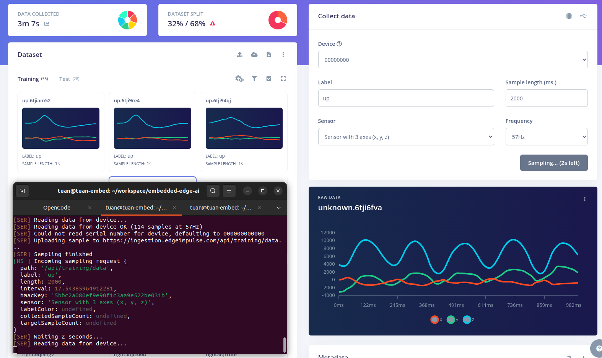
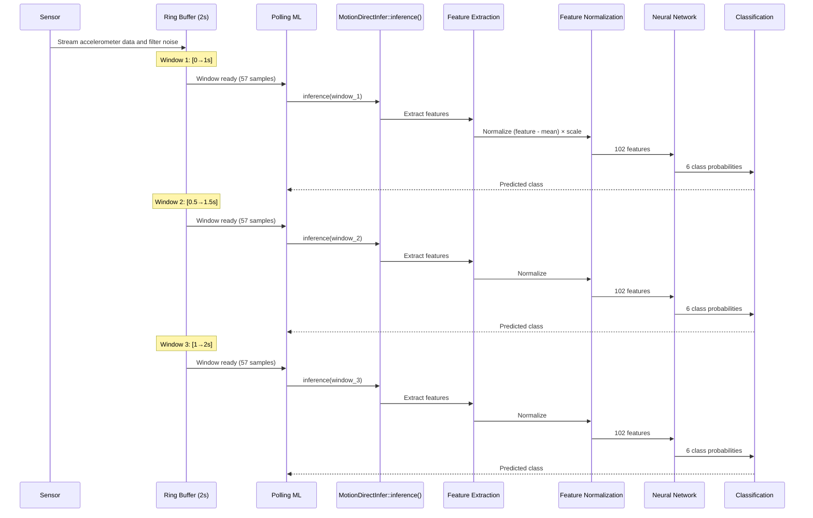
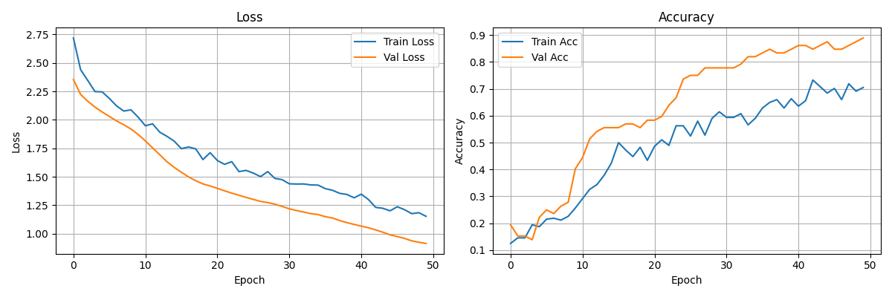

# Motion Direct Classification

## 1. Overview
<div align="center">


**Figure 1:** System block diagram - STM32L151 MCU connected to ICM-20948 IMU, 3-axis accelerometer data processed through DSP pipeline and classified by neural network

</div>

This system classifies motion using the ICM-20948 (9-DoF) sensor on an STM32L151 microcontroller. 3-axis accelerometer data (X, Y, Z) is collected, processed through a DSP pipeline, and fed into a small fully-connected neural network to classify 6 motion states.

### Why I choose **Machine Learing** instead of **Rule-Based Algorithm**
Machine Learning was chosen for this project because it can learn complex motion patterns from sensor data, providing higher classification accuracy, better robustness against variations, and easier scalability than traditional rule-based algorithms. Combined with DSP-based feature extraction and TinyML deployment, the solution enables efficient real-time motion classification on resource-constrained embedded devices.

## 2. Hardware

- **MCU**: STM32L151
- **IMU**: ICM-20948

## 3. Data Collection

Use the Edge Impulse Data Forwarder to stream sensor data from the device to Edge Impulse Studio:

```bash
edge-impulse-data-forwarder --serial-port /dev/ttyUSB0 --baud-rate 115200
```
or
```bash
edge-impulse-data-forwarder
```

The input is accelerometer values on all **3 axes (x, y, z)**.

<div align="center">


**Figure 2:** Terminal confirming successful



**Figure 3:** Edge Impulse Studio data collection interface streaming accelerometer data from device

</div>

### Dataset

The dataset was exported from Edge Impulse located at: [Dataset](../trainning/motion_direct_classify)

<div align="center">


**Figure 4:** Edge Impulse dataset overview with 6 motion classes: idle, left, right, up, down, unknown

</div>

It contains **6 classes**:

| Class | Label       |
|-------|-------------|
| 0     | Down        |
| 1     | Idle  |
| 2     | Left    |
| 3     | Right     |
| 4     | Unknown     |
| 5     | Up     |

## 4. DSP Pipeline

### Time-Domain Features:
- [RMS](https://en.wikipedia.org/wiki/Root_mean_square)
- [Skewness](https://en.wikipedia.org/wiki/Skewness)
- [Kurtosis](https://en.wikipedia.org/wiki/Kurtosis)
### Frequency-Domain Features:
- [FFT]((https://en.wikipedia.org/wiki/Fast_Fourier_transform)) Skewness
- [FFT]((https://en.wikipedia.org/wiki/Fast_Fourier_transform)) Kurtosis
- Log PSD

### Feature Vector Layout (34 features per axis)

| Index | Feature |
|-------|---------|
| 0     | RMS   |
| 1     | Skewness |
| 2     | Kurtosis |
| 3     | Spec_Skew |
| 4     | Spec_Kurt |
| 5-33  | Log PSD Bins (29 bins) |

**Total: 34 features/axis × 3 axes = 102 features**

### CMSIS-DSP
These CMSIS-DSP primitives run on the Cortex-M3 FPU
| Function | Purpose
|---|---|
| `arm_biquad_cascade_df2T_f32` | Applies a 26.05 Hz Butterworth low-pass filter |
| `arm_cfft_f32` | Computes the FFT of the preprocessed signal |
| `arm_mean_f32` | Computes the mean value |
| `arm_offset_f32` | Removes the DC offset by subtracting the mean from each sample before spectral analysis |

## 5. Model Architecture

Compact fully-connected neural network (FCNN):

```
Input:  102 floats (34 features/axis × 3 axes)
FC1:    20 units, ReLU              (20×102 + 20 = 2060)
FC2:    10 units, ReLU              (10×20 + 10 = 210)
FC3:    6 units, Softmax            (6×10  + 6  = 66)
Output: 6 class probabilities       Total: ~2336 floats
```

### Export C header use Emlearn
- File: [Model](../inference/motion_direct_classify/model/motion_direct_classify_model.h)
- Model contains weights + eml_net engine

## 6. Processing Flow

### Sliding Window Buffer

The system uses a sliding window approach with 50% overlap:

```
Time(s):  0    0.5    1    1.5    2
          |-----|-----|-----|-----|
Window 1: [0 ---------> 1s]
Window 2:      [0.5 ---------> 1.5s]
Window 3:           [1 ---------> 2s]
```

- **Window size**: 1 second (57 samples @ 57 Hz)
- **Stride**: 0.5 second (50% overlap)
- **Buffer**: Circular buffer stores 2 seconds of data


## 7. Loss, Accuracy, Confusion Matrix

<div align="center">



**Figure 5:** Training loss and accuracy


**Figure 6:** Confusion matrix on validation set, showing per-class prediction accuracy

</div>

## 8. Video Demo

[](https://github.com/user-attachments/assets/3420db6c-671e-4b4b-a058-6ce20dbc7669)

### [Configuration parameters](../trainning/Motion-Direct-Classify.ipynb)

| Parameter            | Value       | Description              |
|----------------------|-------------|--------------------------|
| axes                 | 3           | Number of axes (X, Y, Z) |
| scale_axes           | 0.00010017  | Raw data scaling factor  |
| filter_type          | low         | Filter type (lowpass)    |
| filter_cutoff        | 26.05 Hz    | Cutoff frequency         |
| filter_order         | 6           | Filter order             |
| fft_length           | 64          | FFT length               |
| do_fft_overlap       | false       | No overlap               |
| sampling_freq        | 57 Hz       | Sampling frequency       |
| raw_samples_per_axis | 57          | Samples per axis         |

## 9. Related Files

| File | Role | 
|------|------| 
| [Training Motion Direct Classify](../trainning/Motion-Direct-Classify.ipynb)   | Training pipeline |
| [Motion Direct Inference](../inference/motion_direct_classify)                        | Class header |
| [Model](../inference/motion_direct_classify/model/motion_direct_classify_model.h)       | Model weights (emlearn) |
| [Sensor](../../task_accel_sensor.cpp)                                 | ICM-20948 driver + ring buffer |

## 10. Reference
| Topic | Description |
| ----- | ----------- |
| [Emlearn](https://github.com/emlearn/emlearn) | Machine learning for microcontroller and embedded systems |
| [EdgeImpulse](https://www.edgeimpulse.com) | Collect Data |