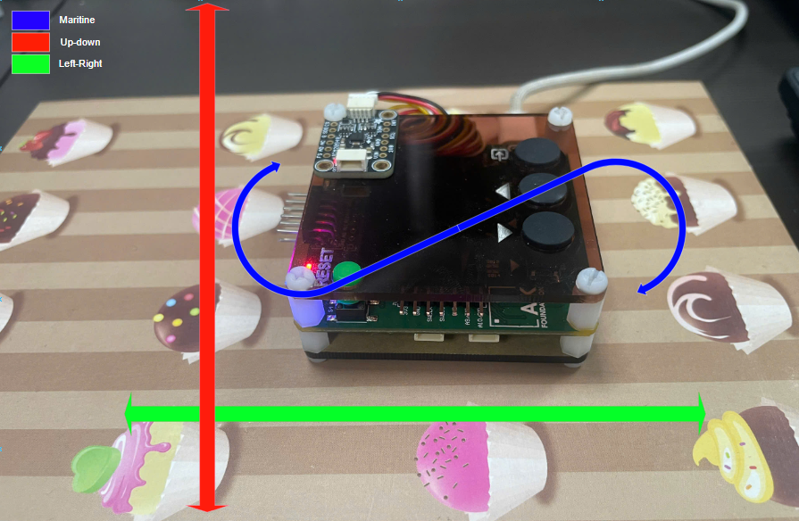
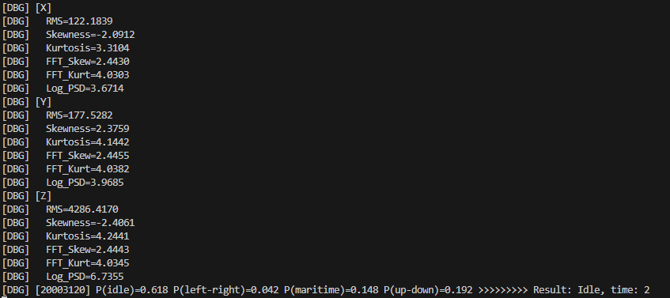
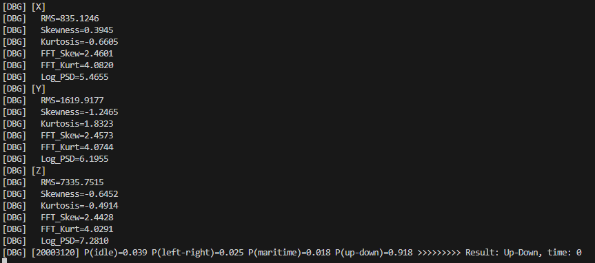
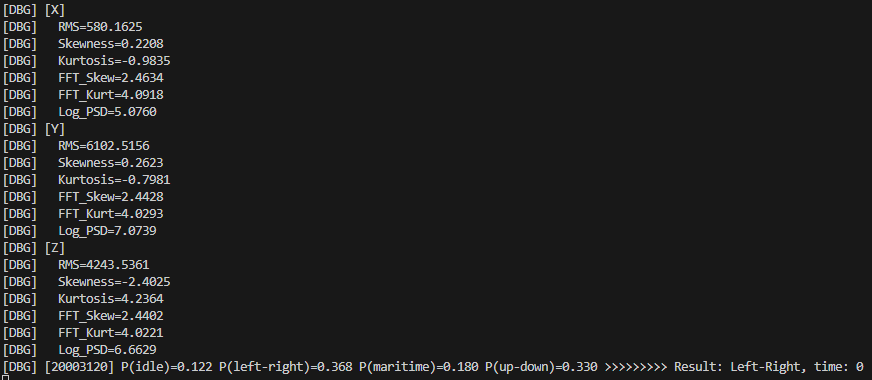
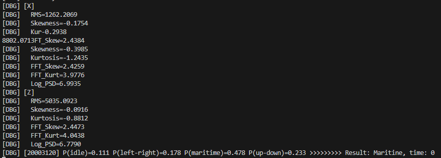

# Anomaly Detection

## 1. Overview

This system detects anomalous motion using the ICM-20948 (9-DoF IMU) sensor on an STM32L151 microcontroller. 3-axis accelerometer data (X, Y, Z) is collected, processed through a DSP pipeline, and fed into a small fully-connected neural network to classify 4 motion states.

## 2. Hardware

- **MCU**: STM32L151 (ARM Cortex-M3)
- **IMU**: ICM-20948 (InvenSense) — I2C interface
- **Sampling rate**: 58 Hz (ACCEL_SAMPLE_RATE_HZ)
- **Window size**: 116 samples (~2 seconds)
- **Unit**: Acceleration

## 3. Data Collection

Use the Edge Impulse Data Forwarder to stream sensor data from the device to Edge Impulse Studio:

```bash
edge-impulse-data-forwarder --serial-port /dev/ttyUSB0 --baud-rate 115200
```
or
```bash
edge-impulse-data-forwarder
```

The input is accelerometer values on all **3 axes (x, y, z)** — a single axis is insufficient for detecting multi-dimensional motion.


### Dataset

The dataset was exported from Edge Impulse located at:
```
nn/trainning/anomaly-detection-export/
```


It contains **4 classes**:

| Class | Label       | Description              | Files |
|-------|-------------|--------------------------|-------|
| 0     | idle        | Stationary / still       | 4     |
| 1     | left-right  | Horizontal shaking       | 4     |
| 2     | maritine    | Vigorous shaking (rattle)| 1     |
| 3     | up-down     | Vertical shaking         | 3     |

Each JSON file contains:
- `payload.values`: array `[x, y, z]`
- `label.label`: class name

## 4. DSP Pipeline — Feature Extraction

For each window of 116 samples per axis (348 values total), the pipeline processes sequentially:

### Pre-processing

Each axis buffer undergoes 3 stages (C++: `anomal_detect.cpp`, Python: `compute_scaler.py`):

1. **Raw scale** — convert raw ADC counts to physical units:
   - C++: `raw * 9.80665 * 0.2`
   - Python: `raw * 0.2`

2. **Butterworth lowpass filter** — 6th order, cutoff 3 Hz:
   - Implemented as 3 cascaded biquad sections (second-order IIR filters)
   - C++: `arm_biquad_cascade_df2T_f32` with coefficients printed directly from the Python `signal.butter` SOS matrix, guaranteeing bit-exact matching
   - Removes high-frequency noise above 3 Hz; human motion is predominantly < 3 Hz

3. **DC removal** — subtract the mean from the filtered signal:
   - `x = x - mean(x)`
   - Removes the gravitational component (DC bias) so only the dynamic acceleration is analyzed

### Time-Domain Features — 3 features/axis

These describe the **shape of the acceleration signal over time**. For each axis, after pre-processing, 3 statistics are computed:

- RMS (Root Mean Square)
- Skewness (3rd standardized moment)
- Kurtosis (Excess Kurtosis, 4th standardized moment − 3)
### Frequency-Domain Features — 3 features/axis
- PSD Computation
- FFT Skewness — spectral asymmetry
- FFT Kurtosis — spectral peakedness
- Log PSD Bin 1 — low-frequency energy

### Feature Vector Layout

The final 18-element feature vector is assembled axis-by-axis:

| Index | Feature |
|-------|---------|
| 0 | RMS |
| 1 | Skewness |
| 2 | Kurtosis |
| 3 | FFT Skew |
| 4 | FFT Kurt |
| 5 | Log PSD bin 1 |

### CMSIS-DSP on-device implementation

The C++ feature extraction on STM32L151 leverages **CMSIS-DSP** for efficient real-time computation:

| CMSIS-DSP function | Usage |
|---|---|
| `arm_biquad_cascade_df2T_f32` | 6th-order Butterworth lowpass filter (3 cascaded biquads, direct-form II transposed) — filters out noise above 3 Hz before feature extraction |
| `arm_cfft_f32` | Complex FFT (len 16) — computes PSD via periodogram across overlapping windows with max-hold aggregation |
| `arm_mean_f32` | Computes mean for DC removal and PSD statistics |
| `arm_offset_f32` | Subtracts mean vector from filtered signal |

These CMSIS-DSP primitives run on the Cortex-M3 FPU, providing deterministic, cycle-counted DSP performance without external library overhead.

## 5. Model Architecture

Compact fully-connected neural network (FCNN):

```
Input:  18 floats (6 features/axis × 3 axes)
FC1:    20 units, ReLU              (20×18 + 20 = 380)
FC2:    10 units, ReLU              (10×20 + 10 = 210)
FC3:    4 units, Softmax            (4×10  + 4  = 44)
Output: 4 class probabilities       Total: ~634 floats
```

### Training details
- **Optimizer**: Adam (lr = 0.0005)
- **Loss**: Sparse Categorical Crossentropy
- **Batch size**: 32
- **Epochs**: max 50, EarlyStopping (patience=10)
- **Validation split**: 20%
- **Normalization**: StandardScaler (baked into the model)

### Export formats

1. **emlearn C header** — used on-device:
    - File: `inference/anomal_detect/model/anomal_detection_v1.h`
    - Contains weights + eml_net engine
    - 2 inference functions:
      - `anomaly_model_predict(features, n)` → class index
      - `anomaly_model_regress(features, n, out, out_len)` → probabilities

## 6. On-Device Inference

### Processing flow

```
ICM-20948 @ 58 Hz  →  Ring buffer (2s = 116 samples)  →  task_polling_ml()
    →  AnomalyInfer::inference(buffer, 116)
    →  DSP feature extraction (require: Python match)
    →  normalization: (feat - mean) × scale
    →  anomaly_model_regress()  (3-layer NN via emlearn)
    →  Softmax → Argmax → [optional] confidence threshold
    →  Returns class (0-3)
```

### Confidence threshold
If max probability < 0.3 and predicted class != 0 (idle), force class to 0 — prevents false positives when the model is uncertain.

## 7. Retraining Guide

1. **Collect data**: use `edge-impulse-data-forwarder` or write directly over serial
2. **Export dataset**: from Edge Impulse or create compatible JSON structure
3. **Run notebook**: open `nn/trainning/Anomaly-Detection.ipynb` in Google Colab
4. **Compute new scaler**: run `nn/trainning/compute_scaler.py` to get NORM_MEAN/NORM_SCALE
5. **Update C++ files**: copy the new header to `inference/anomal_detect/model/` and update scaler values in `anomal_detect.cpp`
6. **Rebuild firmware**: run `make` in the project root
7. **Plot Loss-Accuracy**


8. **Confusion Matrix**


### Configuration parameters (CONFIG)

| Parameter            | Value  | Description              |
|----------------------|--------|--------------------------|
| axes                 | 3      | Number of axes (X, Y, Z) |
| scale_axes           | 0.2    | Raw data scaling factor  |
| filter_type          | low    | Filter type (lowpass)    |
| filter_cutoff        | 3.0 Hz | Cutoff frequency         |
| filter_order         | 6      | Filter order             |
| fft_length           | 16     | FFT length               |
| do_fft_overlap       | true   | 50% overlap              |
| sampling_freq        | 58 Hz  | Sampling frequency       |
| raw_samples_per_axis | 116    | Samples per axis (~2s)   |

## 8. Related Files

| File | Role | 
|------|------| 
| [Trainning-Anomaly-Detection](../trainning/Anomaly-Detection.ipynb) | Colab notebook — training pipeline |
| [Dataset](../trainning/anomaly-detection-export) | Dataset export |
| [Anomal-Implement](../inference/anomal_detect) | AnomalyInfer class header |
| [Model](../inference/anomal_detect/model/anomal_detection_v1.h) | Model weights (emlearn) |
| [Sensor](../../task_accel_sensor.cpp) | ICM-20948 driver + ring buffer |

## 9. Result
### 1. Predict state Idle 


### 2. Predict state Up-Down 


### 3. Predict state Left-Right 


### 4. Predict state Maritine 


## 9. Reference
| Topic | Description |
| ----- | ----------- |
| [Emlearn](https://github.com/emlearn/emlearn) | Machine learning for microcontroller and embedded systems |
| [EdgeImpulse](https://www.edgeimpulse.com) | Collect Data |
| [Arduino Anomaly Detection](https://www.hackster.io/mjrobot/tinyml-made-easy-anomaly-detection-motion-classification-958fd2) | Arduino make Tiny ML |