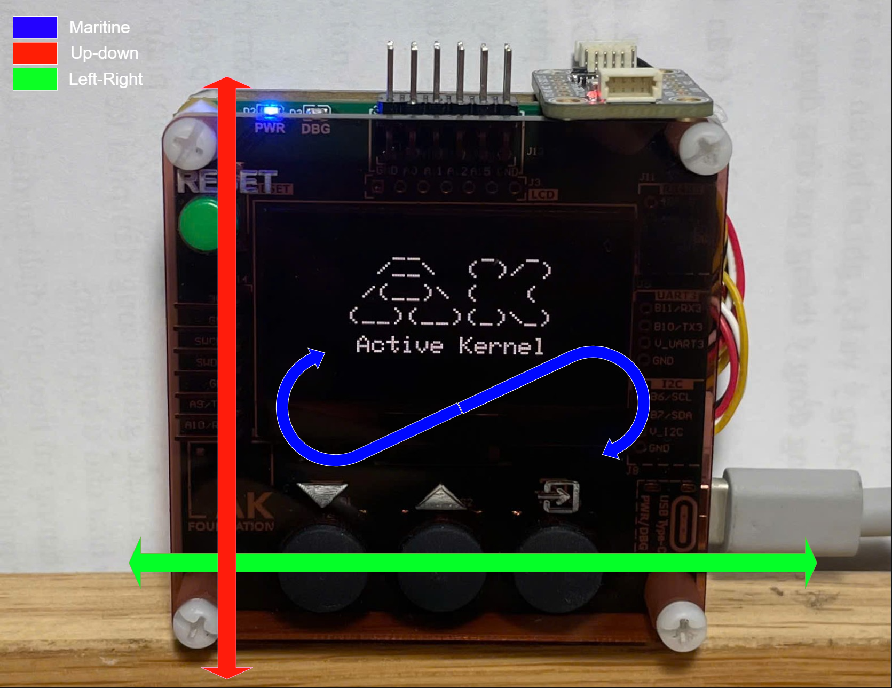
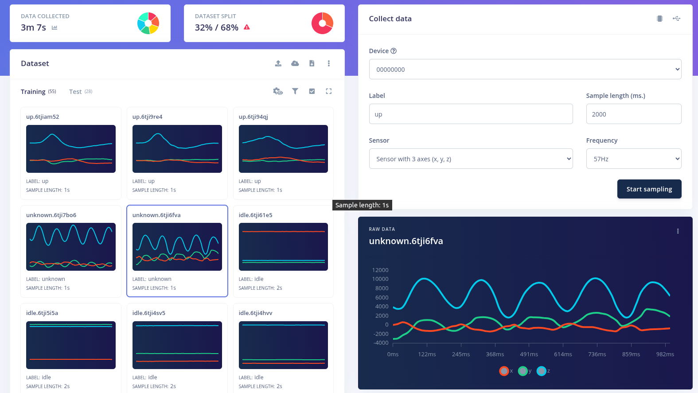
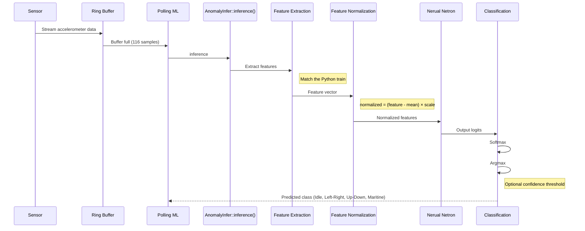
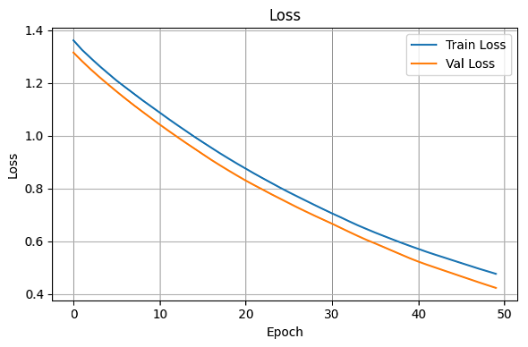
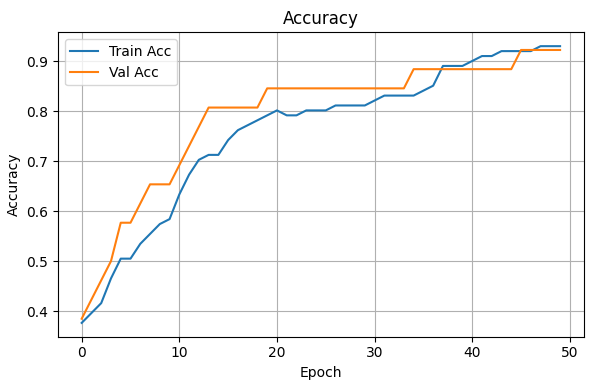
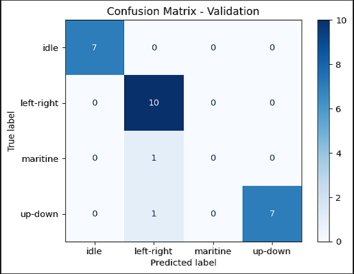

# Anomaly Detection

## 1. Overview
<div align="center">



**Figure 1:** System block diagram - STM32L151 MCU connected to ICM-20948 IMU, 3-axis accelerometer data processed through DSP pipeline and classified by neural network

</div>

This system detects anomalous motion using the ICM-20948 (9-DoF) sensor on an STM32L151 microcontroller. 3-axis accelerometer data (X, Y, Z) is collected, processed through a DSP pipeline, and fed into a small fully-connected neural network to classify 4 motion states.

### Why I choose **Machine Learing** instead of **Rule-Based Algorithm**
Machine Learning was chosen for this project because it can learn complex motion patterns from sensor data, providing higher classification accuracy, better robustness against variations, and easier scalability than traditional rule-based algorithms. Combined with DSP-based feature extraction and TinyML deployment, the solution enables efficient real-time motion classification on resource-constrained embedded devices.

## 2. Hardware

- **MCU**: STM32L151
- **IMU**: ICM-20948

## 3. Data Collection

Use the Edge Impulse Data Forwarder to stream sensor data from the device to Edge Impulse Studio:

```bash
edge-impulse-data-forwarder --serial-port /dev/ttyUSB0 --baud-rate 115200
```
or
```bash
edge-impulse-data-forwarder
```

The input is accelerometer values on all **3 axes (x, y, z)**.

```
Edge Impulse data forwarder v1.39.2
Endpoints:
    Websocket: wss://remote-mgmt.edgeimpulse.com
    API:       https://studio.edgeimpulse.com
    Ingestion: https://ingestion.edgeimpulse.com

[SER] Connecting to /dev/ttyUSB0
[SER] Could not read serial number for device, defaulting to 000000000000
[SER] Serial is connected (00:00:00:00:00:00)
[WS ] Connecting to wss://remote-mgmt.edgeimpulse.com
[WS ] Connected to wss://remote-mgmt.edgeimpulse.com
[SER] Could not read serial number for device, defaulting to 000000000000

? To which project do you want to connect this device? (🔍 type to search) 1046470
[SER] Detecting data frequency...
[SER] Detected data frequency: 57Hz
? 3 sensor axes detected (example values: [2569.3,-4903.3,74510.9]). What do you want to call them? Separate the
 names with ',': x,y,z
[WS ] Device "anomaly" is now connected to project "Anomaly-Detection". To connect to another project, run `edge-impulse-data-forwarder --clean`.
[WS ] Go to https://studio.edgeimpulse.com/studio/1046470/acquisition/training to build your machine learning model!

```
<div align="center">


**Figure 2:** Terminal confirming successful device connection to "Anomaly-Detection" project on Edge Impulse


**Figure 3:** Edge Impulse Studio data collection interface streaming accelerometer data from device

</div>

### Dataset

The dataset was exported from Edge Impulse located at: [Dataset](../trainning/anomaly-detection-export)

<div align="center">



**Figure 4:** Edge Impulse dataset overview with 4 motion classes: idle, left-right, maritine, up-down

</div>

It contains **4 classes**:

| Class | Label       |
|-------|-------------|
| 0     | idle        |
| 1     | left-right  |
| 2     | maritine    |
| 3     | up-down     |

## 4. DSP Pipeline

### Time-Domain Features:
- [RMS](https://en.wikipedia.org/wiki/Root_mean_square)
- [Skewness](https://en.wikipedia.org/wiki/Skewness)
- [Kurtosis](https://en.wikipedia.org/wiki/Kurtosis)
### Frequency-Domain Features:
- [FFT]((https://en.wikipedia.org/wiki/Fast_Fourier_transform)) Skewness
- [FFT]((https://en.wikipedia.org/wiki/Fast_Fourier_transform)) Kurtosis
- Log PSD

### Feature Vector Layout

| Index | Feature |
|-------|---------|
| 0     | RMS   |
| 1     | Skewness |
| 2     | Kurtosis |
| 3     | FFT Skew |
| 4     | FFT Kurt |
| 5     | Log PSD |

### CMSIS-DSP
These CMSIS-DSP primitives run on the Cortex-M3 FPU
| Function | Purpose
|---|---|
| `arm_biquad_cascade_df2T_f32` | Applies a 3 Hz Butterworth low-pass filter |
| `arm_cfft_f32` | Computes the FFT of the preprocessed signal |
| `arm_mean_f32` | Computes the mean value |
| `arm_offset_f32` | Removes the DC offset by subtracting the mean from each sample before spectral analysis |

## 5. Model Architecture

Compact fully-connected neural network (FCNN):

```
Input:  18 floats (6 features/axis × 3 axes)
FC1:    20 units, ReLU              (20×18 + 20 = 380)
FC2:    10 units, ReLU              (10×20 + 10 = 210)
FC3:    4 units, Softmax            (4×10  + 4  = 44)
Output: 4 class probabilities       Total: ~634 floats
```

### Export C header use Emlearn
- File: [Model](../inference/anomal_detect/model/anomal_detection_v1.h)
- Model contains weights + eml_net engine

## 6. Processing Flow


## 7. Loss, Accuracy, Confusion Matrix



**Figure 5:** Training loss curve decreasing over epochs, converging to low value



**Figure 6:** Training accuracy curve increasing and converging, achieving high accuracy on validation set



**Figure 7:** Confusion matrix on validation set, showing per-class prediction accuracy

## 8. Demo

<div align="center">

[](image/demo.mp4)

**Video:** Real-time anomaly detection demo - motion classification on STM32L151 + ICM-20948

</div>

### [Configuration parameters](../trainning/Anomaly-Detection.ipynb)

| Parameter            | Value  | Description              |
|----------------------|--------|--------------------------|
| axes                 | 3      | Number of axes (X, Y, Z) |
| scale_axes           | 0.2    | Raw data scaling factor  |
| filter_type          | low    | Filter type (lowpass)    |
| filter_cutoff        | 3.0 Hz | Cutoff frequency         |
| filter_order         | 6      | Filter order             |
| fft_length           | 16     | FFT length               |
| do_fft_overlap       | true   | 50% overlap              |
| sampling_freq        | 58 Hz  | Sampling frequency       |
| raw_samples_per_axis | 116    | Samples per axis         |

## 9. Related Files

| File | Role | 
|------|------| 
| [Trainning-Anomaly-Detection](../trainning/Anomaly-Detection.ipynb)   | Training pipeline |
| [Dataset](../trainning/anomaly-detection-export)                      | Dataset export |
| [Anomal-Implement](../inference/anomal_detect)                        | AnomalyInfer class header |
| [Model](../inference/anomal_detect/model/anomal_detection_v1.h)       | Model weights (emlearn) |
| [Sensor](../../task_accel_sensor.cpp)                                 | ICM-20948 driver + ring buffer |

## 10. Reference
| Topic | Description |
| ----- | ----------- |
| [Emlearn](https://github.com/emlearn/emlearn) | Machine learning for microcontroller and embedded systems |
| [EdgeImpulse](https://www.edgeimpulse.com) | Collect Data |
| [Arduino Anomaly Detection](https://www.hackster.io/mjrobot/tinyml-made-easy-anomaly-detection-motion-classification-958fd2) | Arduino make Tiny ML |